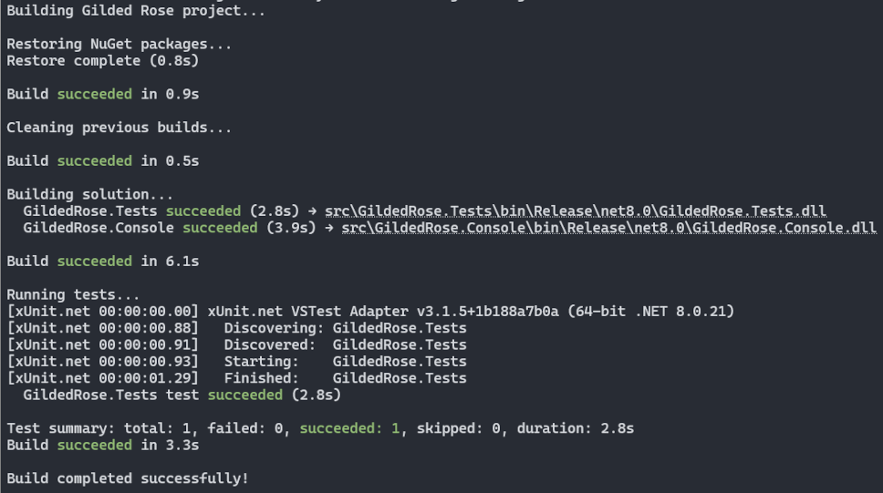

# Valocity Engineering Recruitment Test

Welcome to the Valocity Engineering recruitment test repository! This repository contains two exercises designed to assess candidates for intern and software engineering positions.

## Overview

Choose the exercise that best matches your experience level and the role you're applying for:

1. **Code Review Exercise** - A focused code review task
2. **Gilded Rose Kata** - A refactoring challenge

## Exercise 1: Code Review

### Objective

Review the `CodeToReview.cs` file as if it were part of a pull request submitted by a colleague. Provide constructive feedback on code quality, potential issues, and suggested improvements.

### Instructions

1. Open the [`CodeToReview.cs`](CodeToReview.cs) file
2. Review the code thoroughly, considering:
   - Code correctness and potential bugs
   - Code style and naming conventions
   - Design patterns and best practices
   - Performance considerations
   - Maintainability and readability
3. Provide your feedback in the format you would typically use for a pull request review (e.g., inline comments, summary comments, or a separate document)

### What We're Looking For

- Attention to detail
- Understanding of C# best practices
- Ability to communicate technical feedback constructively
- Problem-solving skills

---

## Exercise 2: Gilded Rose Refactoring Kata

### Background

Hi and welcome to team Gilded Rose! As you know, we are a small inn with a prime location in a prominent city run by a friendly innkeeper named Allison. We also buy and sell only the finest goods. Unfortunately, our goods are constantly degrading in quality as they approach their sell by date. We have a system in place that updates our inventory for us. It was developed by a no-nonsense type named Leeroy, who has moved on to new adventures.

Your task is to add a new feature to our system so that we can begin selling a new category of items.

### The Rules

**Basic System:**
- All items have a `SellIn` value which denotes the number of days we have to sell the item
- All items have a `Quality` value which denotes how valuable the item is
- At the end of each day our system lowers both values for every item

**Special Rules:**
- Once the sell by date has passed, Quality degrades twice as fast
- The Quality of an item is never negative
- "Aged Brie" actually increases in Quality the older it gets
- The Quality of an item is never more than 50
- "Sulfuras", being a legendary item, never has to be sold or decreases in Quality
- "Backstage passes", like aged brie, increases in Quality as its SellIn value approaches:
  - Quality increases by 2 when there are 10 days or less
  - Quality increases by 3 when there are 5 days or less
  - Quality drops to 0 after the concert

### Your Task

We have recently signed a supplier of conjured items. This requires an update to our system:

- **"Conjured" items degrade in Quality twice as fast as normal items**

Feel free to make any changes to the `UpdateQuality` method and add any new code as long as everything still works correctly. However, **do not alter the Item class or Items property** as those belong to the goblin in the corner who will insta-rage and one-shot you as he doesn't believe in shared code ownership (you can make the UpdateQuality method and Items property static if you like, we'll cover for you).

Just for clarification, an item can never have its Quality increase above 50, however "Sulfuras" is a legendary item and as such its Quality is 80 and it never alters.

### Getting Started

1. Clone the repository
2. Run `build.bat` from PowerShell
3. If you see output similar to the screenshot below, you are ready to start refactoring

---

## Submission Guidelines

Please submit your completed exercise(s) according to the instructions provided by your recruiter. Typically this involves:

- Forking this repository
- Committing your changes with clear, descriptive commit messages
- Providing any additional documentation or notes about your approach

## Use of Generative AI

Candidates are permitted to use generative AI tools (such as GitHub Copilot, ChatGPT, or similar) during these exercises. However, please note:

- **Document your usage**: Clearly indicate in your submission where and why you chose to use AI assistance
- **Understand your solution**: These exercises form the foundation for technical discussions during the interview process. You should be prepared to explain and defend your code changes, design decisions, and implementation approach
- **Own your work**: Ensure you fully understand any AI-generated code and can articulate how it solves the problem

We view AI tools as productivity aids, but we're ultimately assessing your engineering judgment, problem-solving approach, and technical communication skills.

## Questions?

If you have any questions about the exercises or the submission process, please reach out to your recruitment contact.

---

## Credits & Attribution

The Gilded Rose Kata is based on the original work by:
- [@TerryHughes](https://twitter.com/TerryHughes)
- [@NotMyself](https://twitter.com/NotMyself)

For more information: [Refactor This: The Gilded Rose Kata](http://iamnotmyself.com/2011/02/13/refactor-this-the-gilded-rose-kata/)

Original repository: [https://github.com/NotMyself/GildedRose](https://github.com/NotMyself/GildedRose)

## License

MIT